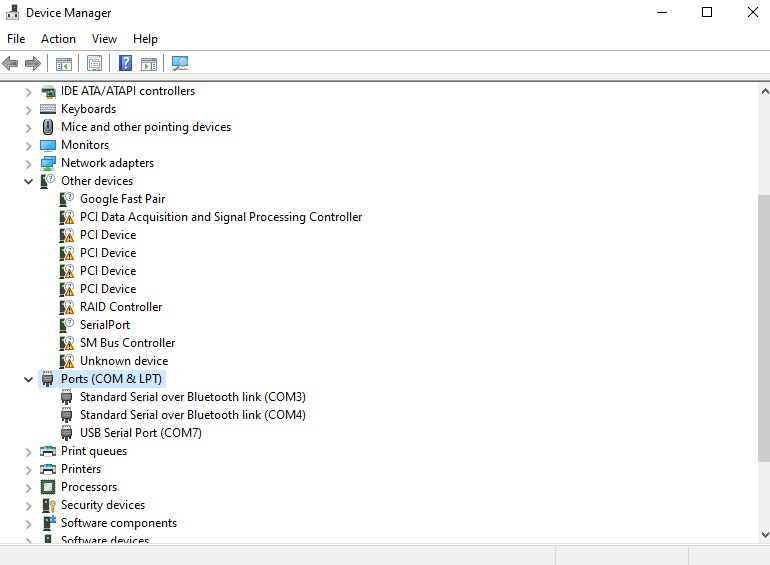
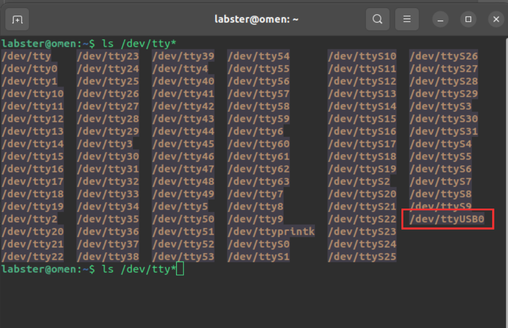

# ExternalGPIOController Library Documentation

This documentation provides an example of how to use the `ExternalGPIOController` library to manage GPIO pins.

## 1. Installation
### Installing USB Drivers (For Windows)
Install [CP210x USB to UART Bridge for Serial Communication](https://www.silabs.com/developers/usb-to-uart-bridge-vcp-drivers?tab=downloads)

 
### Install ExternalGPIOController library
```sh
pip install git+https://github.com/rigbetellabs/ExternalGPIOContoroller_release.git
```

## 2. Usage
Below is an example of how to use the ExternalGPIOController library in your code.
### 1. Importing package and Initialization
#### Importing the library `ExternalGPIOController`
```
from ExternalGPIOController.ExternalGPIOController import ExternalGPIOController
```
#### Initialize the GPIO manager object
`Parmeters :` ( `port` = '/dev/ttyUSB0', `baudrate` = 115200, `timeout` = 1) (Default Values)
```python
gpio_manager = ExternalGPIOController(port='COM6', baudrate=115200, timeout=1)
gpio_manager.start_daemon()
```
### How to find Ports
#### For Windows 
Find Port Number on Windows
+ Open Device Manager, and expand the Ports (COM & LPT) list.
+ `COM` Ports will be listed as below
 

+ Like we can see the `COM` ports is `COM7`

#### For Linux
+ Open terminal and type: ls /dev/*
~~~sh
ls /dev/tty*
~~~ 


## 3. API Reference
### `set_gpio(pin, state)`
+ `Input :` `int` PinNumber , `bool`state
+ `Output :` `int` Returns `0`/ `LOW` or `1` / `HIGH` specifying the state of GPIO  
+  Sets the state of a specified GPIO pin.

### `get_gpio_state(pin)`
+ `Input :` `int` PinNumber
+ `Output :` `int` Returns `0`/ `LOW` or `1` / `HIGH` specifying the state of GPIO  
+  Returns the current state of a specified GPIO pin.

### `get_gpio_state_all()`
+ `Input :` `None` 
+ `Output :` `int []` Returns array with `0`/ `LOW` or `1` / `HIGH` specifying the state of all GPIO  
+ Returns the current states of all GPIO pins as a dictionary.

### `start_daemon()`
+ `Input :`  `None` 
+ `Output :` `None` 
+ Starts the GPIO control daemon.
### `stop_daemon()`
+ `Input :`  `None` 
+ `Output :` `None` 
+ Stops the GPIO control daemon.

